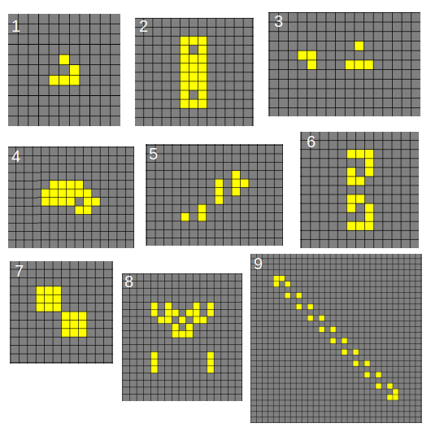
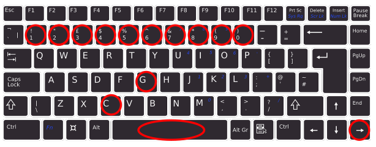

# Conway's Game of Life

Implementation of the famous **Conway's Game of Life** using **Python** and **Pygame**. Hope you enjoy it!


## Introduction

[Conway's Game of Life](https://en.wikipedia.org/wiki/Conway%27s_Game_of_Life) is a classic cellular automaton devised by British mathematician [John Horton Conway](https://en.wikipedia.org/wiki/John_Horton_Conway) in 1970. It's not a conventional game in the traditional sense but a simulation of a simple and fascinating universe of "*cells*" that follow specific rules to evolve over generations. The game demonstrates how complex patterns can emerge from simple rules and is a popular subject in computer science and recreational mathematics.

It is a *zero-player game*, meaning that its evolution is determined by its initial state, requiring no further input. One interacts with the Game of Life by creating an initial configuration and observing how it evolves. It is [Turing complete](https://en.wikipedia.org/wiki/Turing_completeness) and can simulate a universal constructor or any other Turing machine. In other words, anything that can be computed algorithmically can be computed within the *Game of Life*.


## Rules
The universe of the Game of Life is a two-dimensional orthogonal grid of square cells, each of which is in one of two possible states: **living** or **dead**. Every cell interacts with its eight neighbors, which are the cells that are horizontally, vertically, or diagonally adjacent.

At each step in time, the following transitions occur:

- **Underpopulation**: Any living cell with fewer than two living neighbors dies.
- **Survival**: Any live cell with two or three living neighbors lives on to the next generation.
- **Overpopulation**: Any living cell with more than three living neighbors dies.
- **Reproduction**: Any dead cell with exactly three living neighbors becomes a living cell.

All other dead cells stay dead. These simple rules lead to fascinating patterns and behaviors that can be observed as the game progresses.

**NOTE:** You are allowed to modify the Rules of the game as you wish in the ```config.yml``` file.


## Project structure
- ```main.py```: The main Python script that implements Conway's Game of Life using Pygame.
- ```README.md```: This file, providing an overview of the project.
- ```readme_images/```: Contains the images used in this README file.
- ```LICENSE```: The project's license information (MIT License).
- ```requirements.txt```: Contains the list of Python libraries needed to work on this project.
- ```config.yml```: Stores constants used in the project.
- ```seed_patterns.yml```: Contains 9 pre-defined initial patterns to start with.

## Seed patterns
The **initial pattern** constitutes the seed of the system. The first generation is created by applying the Rules of the Game simultaneously to every cell in the seed (living or dead). Births and deaths occur simultaneously. **Each generation is a pure function of the preceding one**. The rules continue to be applied repeatedly to create further generations.

Many different types of patterns occur in the Game of Life, which are classified according to their behavior. Common pattern types include: 
- **still lifes**: which do not change from one generation to the next.
- **oscillators**: which return to their initial state after a finite number of generations.
- **spaceships**: which translate themselves across the grid.

Many patterns in the Game of Life eventually become a combination of still lifes, oscillators, and spaceships; other patterns may be called chaotic. A pattern may stay chaotic for a very long time until it eventually settles into such a combination.

In this project, we offer you **9 pre-defined initial (seed) patterns** that have been widely studied and show different properties and behaviors:
1. Glider  [Spaceships, moves diagonally]
2. Penta-decathlon  [Oscillator, period 15]
3. Diehard  [disappears after 130 generations]
4. Heavy-weight spaceship  [Spaceship, moves horizontally]
5. Minimal pattern (just 10 living cells) that exhibits infinite growth
6. Beautiful pattern [eventually stabilized in different shapes]
7. Two 3x3 squares  [Oscillator, period 8]
8. Beautiful pattern that creates different forms of life
9. Infinite Loop [Oscillator]



**NOTE**: There are an infinite number of different seed patterns. Feel free to test new seeds!


## Getting started
First, ensure you have [Python](https://www.python.org/downloads/) installed.

Before installing the **Python libraries** used in this project, you may want to create a **Python Virtual Environment** ([venv](https://docs.python.org/3/library/venv.html)), to avoid problems if you are working on other projects as well.

The Python Libraries used in this project are listed in the ```requirements.txt``` file. There you will find the Python libraries and their versions. You may use a package manager called ```pip``` to install them. If ```pip``` is not installed, you need to install it. If you have ```Python 3.4``` or newer, ```pip``` should come pre-installed.

Run the following command to install the libraries listed in your requirements.txt file:
```bash
pip install -r requirements.txt
```

After running the command, ```pip``` will download and install the specified packages and their dependencies. You can verify that the libraries were successfully installed by checking their versions:
```
pip list
```


## Controls
You can control the simulation using your *keyboard* and your *mouse*. Here is a list of all the actions you can take to control everything:
- **With the mouse:**
  - ```"Mouse click"```: Change the state of the selected cell (dead <--> living)
- **With the KeyBoard:**
    - ```"space_bar"```: pause or resume the simulation
    - ```g```: generate an initial random pattern
    - ```c```: clear the screen, empty the grid (kill all the cells)
    - ```--> "right arrow"```: run the next step of the simulation (if paused)
    - Numerical keys from ```0``` to ```9```: generate one of the available pre-defined initial patterns (found in ```seed_patterns.yml```)



## Customize your Game
Almost every aspect of this simulation can be customized. You are allowed to modify the pre-defined initial patterns (```seed_patterns.yml```), but also the rules, the size of the grid, colors, etc (```config.yml```).

The code was done so you **DO NOT** need to modify the Python code ```main.py```. Just play with the two YAML files.


## About Pygame
[Pygame](https://www.pygame.org/docs/) is a cross-platform set of Python modules designed for writing video games. It is built on top of the *Simple DirectMedia Layer* (SDL) library and provides a simple way to create games and multimedia applications. Pygame is widely used for 2D game development and interactive simulations. In this project, Pygame is used to create a graphical interface for the Conway's Game of Life simulation.


## About YAML
[YAML](https://yaml.org/spec/1.2.2/) (*"Yet Another Markup Language"*) is a human-readable data serialization format. It's often used for configuration files, data exchange between languages with different data structures, and in various applications where data needs to be stored, transmitted, or configured in a human-readable format. YAML's design aims to be simple and easy for both humans to read and write and for machines to parse and generate.


## About NumPy
[NumPy](https://numpy.org/doc/), which stands for "Numerical Python," is a fundamental Python library for numerical computing. It provides support for working with large, multi-dimensional arrays and matrices, as well as a collection of high-level mathematical functions to operate on these arrays. NumPy is one of the core libraries in the Python scientific and data science ecosystem and serves as the foundation for many other libraries and tools.


## Contribute
Contributions to this project are welcome! If you'd like to improve the game, fix bugs, or add new features, feel free to fork the repository and submit a pull request.


## License
This project is licensed under the MIT License. See the [LICENSE file](./LICENSE) for details.


## Acknowledgments
John Horton Conway for inventing Conway's Game of Life.


## Hope you enjoyed it! Thanks! :)
